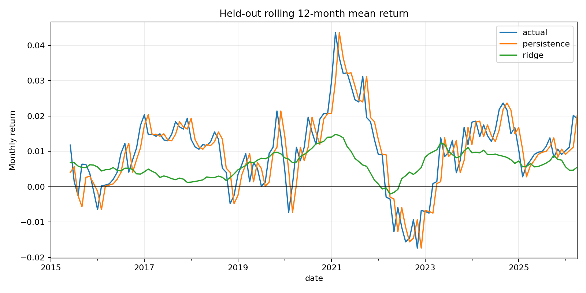

# Financial Forecasting Baseline and Research Scaffold

[](https://github.com/WenqiDing-CompFin/AAAI-Financial-TimeSeries/actions/workflows/ci.yml)
[](https://www.python.org/)
[](LICENSE)

This repository is a **runnable forecasting baseline and research scaffold** and
an honest starting point for adapting ideas from the AAAI 2025 TimeCAP paper. It provides
the data, evaluation, and reproducibility controls that a later model adaptation
must beat.

> **Scope:** this is not yet a full reimplementation of the TimeCAP LLM-agent
> architecture. It does not claim S&P 500 minute-level results. The default data
> are deterministic and synthetic, so every result validates the pipeline rather
> than demonstrating historical market predictability.

> **CV wording:** describe this as a *financial forecasting baseline* or
> *time-series research scaffold*. Do not describe it as a complete TimeCAP
> reimplementation.

The repository has two deliberately separate evidence tracks:

| Track | Data | Purpose |
|---|---|---|
| Offline harness | Fixed-seed synthetic asset panel | Verify feature timing, ticker boundaries, model selection, and deterministic CI |
| Public-market baseline | Official Kenneth French monthly U.S. factor returns | Evaluate Ridge versus persistence on a fixed 2015-latest held-out period |

## What Is Implemented

| Research control | Implementation |
|---|---|
| Offline reproduction | Fixed-seed synthetic monthly panel; no API key or download required |
| Target timing | Features at month `t`; close-to-close return at `t+1` is the target |
| Leakage control | Every lag and rolling window is computed within ticker |
| Model selection | Chronological 60% train / 20% validation / 20% test split |
| Preprocessing | Standardizer fitted on train only during selection |
| Baselines | Persistence and Ridge regression |
| Final evaluation | Alpha selected on validation; model refitted on train + validation; test opened once |
| Audit artifacts | Metrics, row-level test predictions, metadata, and a test-period chart |
| Quality gate | Seven automated tests and GitHub Actions on Python 3.10-3.12 |

## Public Real-Market Baseline

The public-data run downloads the official U.S. five-factor and momentum
archives, records their SHA-256 hashes, builds features known at month `t`, and
predicts market excess return at `t+1`. Calendar partitions are fixed:

- train through December 2004;
- validation from January 2005 through December 2014;
- held-out test from January 2015 through April 2026.

```bash
python run_public_experiment.py
```

The committed May 2026 source snapshot produces:

| Model | Test MSE | Test MAE | Directional accuracy |
|---|---:|---:|---:|
| Persistence | 0.004544 | 0.050413 | 58.09% |
| Ridge, validation-selected alpha 10.0 | 0.002055 | 0.034418 | 62.50% |

Ridge improves all three registered metrics in this aggregate-data test. The
result is a forecasting baseline, not an investable strategy: it has no security
selection, execution model, transaction costs, event retrieval, or TimeCAP agent
architecture. Source URLs, archive members, hashes, features, and split dates are
stored in `results/public_market/experiment_metadata.json`.



## Quick Start

```bash
git clone https://github.com/WenqiDing-CompFin/AAAI-Financial-TimeSeries.git
cd AAAI-Financial-TimeSeries
python -m venv .venv
```

Activate the environment, then run:

```bash
python -m pip install -e ".[dev]"
python -m pytest -q
python run_experiment.py
```

Generated files are written to `results/`:

- `metrics.csv`: held-out MSE, MAE, and directional accuracy;
- `test_predictions.csv`: row-level actual and predicted returns;
- `experiment_metadata.json`: seed, features, target, and split policy;
- `test_equity_curve.png`: diagnostic cumulative paths on synthetic test rows.

Use a different deterministic seed or output directory:

```bash
python run_experiment.py --seed 11 --output-dir results/seed_11
```

### Default Seed-7 Check

The reproducible synthetic test partition currently contains 1,050 asset-month
rows from January 2022 through November 2024:

| Model | Test MSE | Test MAE | Directional accuracy |
|---|---:|---:|---:|
| Persistence | 0.001028 | 0.024378 | 54.86% |
| Ridge, validation-selected alpha 0.01 | 0.000569 | 0.017999 | 53.43% |

Ridge improves squared and absolute error but does not improve directional
accuracy. Reporting that mixed result is intentional: the repository is an
evaluation scaffold, not a performance advertisement.

## Research Design

The four baseline inputs are one-month return, lagged three-month return,
lagged six-month volatility, and one-month volume change. The prediction target
is the next monthly return. Ridge regularization strength is chosen only by
validation MSE from `(0.01, 0.1, 1.0, 10.0)`.

The persistence baseline predicts that next month's return equals the latest
observed return. It prevents a more complicated model from looking useful merely
because it is compared with zero.

See [experiment protocol](docs/experiment_protocol.md) for the frozen hypothesis,
split rules, acceptance criteria, and failure conditions.

## Project Structure

```text
AAAI-Financial-TimeSeries/
|-- .github/workflows/ci.yml
|-- docs/experiment_protocol.md
|-- results/README.md
|-- run_public_experiment.py
|-- src/financial_timeseries/
|   |-- data.py
|   |-- experiment.py
|   |-- metrics.py
|   `-- public_data.py
|-- tests/test_experiment.py
|-- pyproject.toml
`-- run_experiment.py
```

## Current Interpretation

The experiment is useful for testing temporal separation, feature timing, model
selection, deterministic output, and CI. Synthetic test metrics are not evidence
of alpha and should not be quoted as real-market performance in an application,
paper, or interview.

The public-market track closes the absence-of-real-observations gap for aggregate
factor forecasting. It does not close security-level universe, corporate-action,
execution, cost, or capacity questions. A complete TimeCAP adaptation would add
event retrieval, contextualization, augmentation, ablations, and comparison with
the original architecture while preserving this evaluation harness.

## References

- [TimeCAP paper](https://arxiv.org/abs/2502.11418)
- [Original TimeCAP repository](https://github.com/geon0325/TimeCAP)

This project is independent educational work and is not affiliated with the
paper's authors. It is not investment advice.
